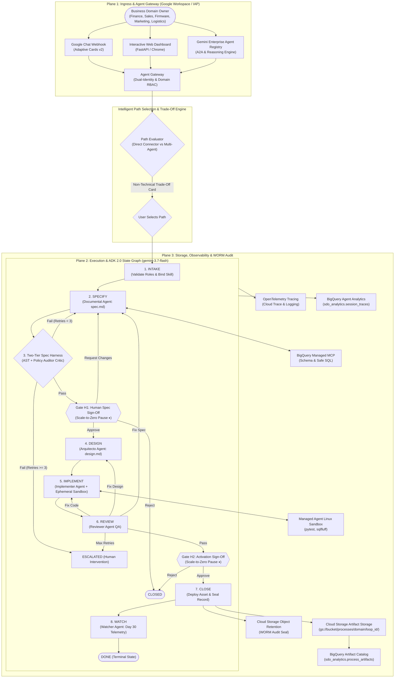

# Autonomous SDO Platform — Autonomous Software & Data Delivery Engine on Google Cloud Platform

[](https://www.python.org/)
[](https://cloud.google.com/vertex-ai)
[](https://adk.dev)
[](https://cloud.google.com/storage/docs/bucket-lock)
[-brightgreen.svg)](tests/)
[](eval/)

> **Wallbox Software Delivery Optimization (SDO) Platform**  
> An enterprise-grade, human-supervised delivery platform built on **Google Cloud Platform (GCP)**. It empowers non-technical business domain owners (Finance, Sales, Firmware, Marketing, Logistics) to automate workflows using **Gemini 3.7 Flash**, **Google ADK 2.0 State Graphs**, and **Managed GCP & Enterprise MCP Connectors**.

---

## 📑 Table of Contents
1. [Executive Summary & Core Highlights](#-executive-summary--core-highlights)
2. [Level 300 GCP Reference Architecture](#-level-300-gcp-reference-architecture)
3. [3-Plane Governance Model](#-3-plane-governance-model)
4. [Agent Gateway & Dual-Identity Protocol](#-agent-gateway--dual-identity-protocol)
5. [Agent Registry in Gemini Enterprise](#-agent-registry-in-gemini-enterprise)
6. [Multi-Domain Skill Registry & Security Policies](#-multi-domain-skill-registry--security-policies)
7. [Intelligent Path Selection: Direct Connector vs. Multi-Agent](#-intelligent-path-selection)
8. [GCS Structured Artifact Storage & BigQuery Catalog](#-gcs-structured-artifact-storage--bigquery-catalog)
9. [Two-Tier Quality Harness & Ephemeral Sandboxes](#-two-tier-quality-harness--ephemeral-sandboxes)
10. [Observability & WORM Audit Substrate](#-observability--worm-audit-substrate)
11. [Quickstart & Test Verification](#-quickstart--test-verification)
12. [1-Click Multi-Project Replication Guide](#-1-click-multi-project-replication-guide)
13. [Repository Structure](#-repository-structure)

---

## ⚡ Executive Summary & Core Highlights

- **Gemini 3.7 Flash Reasoning Engine:** 2,000,000 token context window, eliminating legacy AWS token truncation.
- **100% Deterministic ADK 2.0 State Graphs:** State transitions and cyclic retry budgets ($N=3$) are calculated strictly in Python. Zero LLM routing.
- **Agent Gateway:** Inspects caller permissions and Google Workspace / IAP identity upfront, enforcing domain RBAC and separating Human from Machine identities.
- **Agent Registry:** Manages registered agents in Gemini Enterprise, cataloging A2A bridges and upcoming managed GCP / enterprise MCPs (Salesforce, NetSuite, Notion).
- **Multi-Domain Skill Registry (5 Domains):** Modular YAML manifests (`finance.yaml`, `sales.yaml`, `firmware.yaml`, `marketing.yaml`, `logistics.yaml`) governing Intake, Spec Policies, and Sandbox Acceptance Criteria.
- **Intelligent Delivery Path Selection:** Evaluates business briefs and presents non-technical **Trade-Off Cards** (Direct Connector Automation vs. Autonomous Multi-Agent Development) with zero jargon.
- **Scale-to-Zero Human Governance:** Human gates (**Gate H1** for specifications, **Gate H2** for deployment/activation) pause compute at $0 idle cost without session timeout crashes.
- **GCS + BigQuery Process Artifact Catalog:** Stores deliverables in partitioned Cloud Storage (`gs://<bucket>/processes/{domain}/{loop_id}/`) and indexes them in BigQuery (`sdo_analytics.process_artifacts`) for instant search and monitoring.
- **Two-Tier Quality Harness:** Tier 1 static AST/regex rules + Tier 2 `PolicyAuditorAgent` compliance critic.
- **Ephemeral Managed Linux Sandbox:** Isolated container runner executing `pytest` with a 100% pass guarantee.
- **WORM Audit Trail:** Cloud Storage Object Retention (Bucket Lock in WORM mode) for immutable SHA-256 compliance.

---

## 🏗 Level 300 GCP Reference Architecture



---

## 🛡 3-Plane Governance Model

```
+-------------------------------------------------------------------------------------------------------+
| PLANE 1: DEFINITIONS & CONTRACTS (Multi-Domain Skill Registry & Agent Gateway)                        |
| Domain Manifests (finance, sales, firmware, marketing, logistics), Pydantic Schemas, Agent Prompts    |
+-------------------------------------------------------------------------------------------------------+
                                                  |
                                                  v
+-------------------------------------------------------------------------------------------------------+
| PLANE 2: DELIVERABLES & WORK PRODUCTS (GCS Process Artifacts & Ephemeral Sandboxes)                   |
| spec.md, design.md, SQL Views, Python Logic, Sandbox Test Suites, Pull Requests, Tags                |
+-------------------------------------------------------------------------------------------------------+
                                                  |
                                                  v
+-------------------------------------------------------------------------------------------------------+
| PLANE 3: IMMUTABLE AUDIT EVENT LOG (Cloud Storage WORM Lock & BigQuery Catalog Index)                 |
| SHA-256 Hashed JSON State Trajectories, OpenTelemetry Cloud Trace Spans, Artifact Index Table        |
+-------------------------------------------------------------------------------------------------------+
```

---

## 🚪 Agent Gateway & Dual-Identity Protocol

Located in [`gateway/`](gateway):
- **OIDC & IAP Header Extraction ([`gateway/auth.py`](gateway/auth.py)):** Authenticates incoming user identities from Google Workspace or Identity-Aware Proxy (`X-Goog-Authenticated-User-Email`).
- **Dual-Identity Classification:** Strictly separates **Human User Actions** from **Machine Agent Service Accounts** (`sa-sdo-{node}@managed-agent-504409.iam.gserviceaccount.com`).
- **Domain RBAC & Table Allowlisting ([`gateway/policy_interceptor.py`](gateway/policy_interceptor.py)):** Intercepts initiation at `INTAKE`, matches roles against the domain manifest, and blocks unauthorized cross-tenant requests before LLM invocation.

### 🌐 Interactive Visualizer: Multi-MCP Credential Delegation (BigQuery + Databricks)
Explore how the Agent Gateway securely delegates credentials across Google Cloud (BigQuery IAM) and external SaaS platforms (Databricks, Salesforce, NetSuite, Jira) without exposing tokens to the LLM:

👉 **[Launch Live Cloud Run Visualizer: Enterprise Authentication & Credential Delegation Flow](https://html-interactive-visualizer-c2rnccvaca-ew.a.run.app/auth_credential_delegation_flow.html)**  
*(Local file: [`docs/03_post_implementation_and_operations/auth_credential_delegation_flow.html`](docs/03_post_implementation_and_operations/auth_credential_delegation_flow.html))*

---

## 🏛 Agent Registry in Gemini Enterprise

Both agent deployment variants are registered in the **Google Discovery Engine / Gemini Enterprise Agent Catalog**:
- **Option A (`4439114975457332401`):** `Wallbox SDO - Option A (Vertex AI Agent Runtime Engine)` executing ADK State Graphs directly on Vertex AI (Primary / Default).
- **Option B (`2480784782936961193`):** `Wallbox SDO - Option B (Cloud Run A2A with Web Dashboard & Gates)` exposing the A2A Agent Card (Backup / Dedicated Web Dashboard).
- **Extensible MCP Catalog:** Ready to register upcoming managed GCP MCPs and third-party enterprise tools (Salesforce, NetSuite, Notion).

---

## 📂 Multi-Domain Skill Registry & Security Policies

Located in [`registry/skills/`](file:///usr/local/google/home/papelamine/Documents/Google/Dev/enterprise/Wallbox%20Public%20Shared/sdo-adk-engine/registry/skills), 5 domain manifests govern the full delivery lifecycle:

| Domain | Manifest | Authorized BigQuery Tables | Mandatory Business Metrics | Prohibited Operations |
|---|---|---|---|---|
| **Finance** | [`finance.yaml`](file:///usr/local/google/home/papelamine/Documents/Google/Dev/enterprise/Wallbox%20Public%20Shared/sdo-adk-engine/registry/skills/finance.yaml) | `sdo_finance_demo.invoices`, `billing_events`, `exchange_rates`, `revenue_summary` | `reconciliation_variance_tolerance_pct`, `unreconciled_invoice_amount_usd` | `DROP TABLE`, `DELETE FROM`, unhedged currency conversion |
| **Sales** | [`sales.yaml`](file:///usr/local/google/home/papelamine/Documents/Google/Dev/enterprise/Wallbox%20Public%20Shared/sdo-adk-engine/registry/skills/sales.yaml) | `sdo_sales_demo.opportunities`, `accounts`, `pipeline_snapshots` | `conversion_variance_pct`, `weighted_pipeline_revenue_usd` | `DROP TABLE`, plain-text PII export |
| **Firmware** | [`firmware.yaml`](file:///usr/local/google/home/papelamine/Documents/Google/Dev/enterprise/Wallbox%20Public%20Shared/sdo-adk-engine/registry/skills/firmware.yaml) | `sdo_firmware_demo.charger_telemetry`, `error_logs`, `firmware_versions` | `telemetry_ingestion_delay_ms`, `error_frequency_per_charge_point` | `DROP TABLE`, raw token leakage, unvalidated OCPP frames |
| **Marketing** | [`marketing.yaml`](file:///usr/local/google/home/papelamine/Documents/Google/Dev/enterprise/Wallbox%20Public%20Shared/sdo-adk-engine/registry/skills/marketing.yaml) | `sdo_marketing_demo.campaign_events`, `user_acquisitions`, `touchpoint_attribution` | `cac_calculation_variance_pct`, `first_touch_attribution_pct` | `DROP TABLE`, unhashed customer emails, unconsented analytics |
| **Logistics** | [`logistics.yaml`](file:///usr/local/google/home/papelamine/Documents/Google/Dev/enterprise/Wallbox%20Public%20Shared/sdo-adk-engine/registry/skills/logistics.yaml) | `sdo_logistics_demo.inventory`, `warehouse_dispatch`, `transit_events` | `dispatch_sla_compliance_pct`, `inventory_turnover_ratio` | `DROP TABLE`, manual stock override |

---

## 🧭 Intelligent Path Selection: Direct Connector vs. Multi-Agent

Business users are presented with a clear, non-technical **Trade-Off Card** at Intake:

```
+---------------------------------------------------------------------------------------------------------+
|                                    DELIVERY PATH SELECTION MATRIX                                       |
+---------------------------------------------------------------------------------------------------------+
| Path Option 1: Direct Connector Automation (Tool-Native / MCP)                                          |
| • Best For:        Data reports, analytical views, and workflows pulling from Salesforce, NetSuite, BQ |
| • Business Pros:   Lightning Fast (< 5s), $0 server compute, direct data warehouse execution            |
| • Business Cons:   Best for standard queries; does not build custom software microservices              |
| • Governance:      Two-Tier Spec Gate + Gate H1 + Gate H2 + WORM Audit Trail                            |
+---------------------------------------------------------------------------------------------------------+
| Path Option 2: Autonomous Multi-Agent Software Development (Full ADK Graph)                            |
| • Best For:        Bespoke data engineering algorithms, custom Python logic, APIs, OCPP error decoders  |
| • Business Pros:   Synthesizes custom Python code, creates blueprints, isolated Linux sandbox (100% pass)|
| • Business Cons:   Multi-stage synthesis takes slightly longer (~30-60s)                               |
| • Governance:      Two-Tier Quality Harness + Gate H1 + Gate H2 + Ephemeral Sandbox + WORM Audit Trail  |
+---------------------------------------------------------------------------------------------------------+
```

---

## 📦 GCS Structured Artifact Storage & BigQuery Catalog

All process deliverables are stored in a structured hierarchy in **Google Cloud Storage (GCS)** and indexed in **BigQuery** (`sdo_analytics.process_artifacts`):

- **GCS Storage Path:** `gs://<bucket>/processes/{domain}/{loop_id}/{artifact_name}`
- **BigQuery Index Schema:**
  - `artifact_id`: Deterministic unique identifier (e.g. `ART-FINANCE-125744-spec_md`)
  - `loop_id`: Delivery loop identifier
  - `domain`: Business domain (`finance`, `sales`, `firmware`, `marketing`, `logistics`)
  - `artifact_name`: Filename (`spec.md`, `view.sql`, `test_results.json`)
  - `artifact_type`: Classification (`SPECIFICATION`, `SQL_VIEW`, `PYTHON_CODE`, `TEST_REPORT`)
  - `gcs_uri`: Full Cloud Storage URI (`gs://...`)
  - `content_sha256`: Cryptographic integrity hash
  - `size_bytes`: Byte length
  - `created_at` / `created_by`: Provenance metadata

---

## 🚀 Quickstart & Local Verification

### 1. Install Dependencies
```bash
git clone https://github.com/Gbrit642/sdo-delivery-platform.git
cd sdo-delivery-platform
pip install -e ".[dev]"
```

### 2. Run Full Automated Test Suite (47 Tests)
```bash
python3 -m pytest tests/ -v
```

### 3. Run Offline Benchmark Evaluation Suite
```bash
python3 -m eval.evaluator --benchmark eval/benchmarks/finance_benchmarks.json
```
*Expected Output: Aggregate score 1.00 / 1.00 (PASS).*

### 4. Start Local Web Dashboard & API
```bash
python3 -m uvicorn web.app:app --host 127.0.0.1 --port 8080 --reload
```
Open **`http://localhost:8080`** in **Google Chrome** to launch loops and compare trade-offs.

---

## 🔄 1-Click Multi-Project Replication Guide

To rebuild and deploy this entire platform into any new GCP project:

```bash
export NEW_PROJECT_ID="your-target-project-id"
export REGION="us-central1"

# 1. Apply Terraform Infrastructure
cd terraform
terraform init
terraform apply \
  -var="project_id=${NEW_PROJECT_ID}" \
  -var="region=${REGION}" \
  -auto-approve

# 2. Deploy & Register to Gemini Enterprise
cd ..
./scripts/deploy_both_to_gemini_enterprise.sh
```

---

## 📁 Repository Structure

```
sdo-adk-engine/
├── pyproject.toml                  # Python 3.12+, google-adk>=2.5.0, google-genai, fastapi, pytest
├── Dockerfile                      # Production container packaging
├── Procfile                        # Cloud Buildpacks container entrypoint
├── deployment_metadata.json        # Gemini Enterprise deployment metadata
├── README.md                       # Master platform guide
├── config/
│   ├── settings.py                 # Pydantic Settings (GCP Project: managed-agent-504409, Model: gemini-3.7-flash)
│   └── nodes.yaml                  # Multi-tenant domain definitions (finance, sales, firmware, marketing, logistics)
├── gateway/
│   ├── auth.py                     # Google Workspace / IAP identity & Dual-Identity classification
│   ├── policy_interceptor.py       # Domain access control, table allowlists & Skill binding
│   └── chat_adapter.py             # Google Chat Adaptive Cards v2 formatter
├── registry/
│   ├── skill_registry.py           # Dynamic YAML skill loader and policy engine
│   └── skills/                     # Domain manifests (finance, sales, firmware, marketing, logistics)
├── graphs/
│   ├── state.py                    # Master LoopState Pydantic model (with path selection & GCS URIs)
│   ├── router.py                   # 100% deterministic Python routers (spec harness, review, gates)
│   └── workflow.py                 # ADK StateGraph construction & compilation
├── agents/
│   ├── tradeoff_evaluator.py       # Path Selection & Non-Technical Trade-Off Evaluator
│   ├── documental.py               # Documental Agent (spec.md authoring with gemini-3.7-flash)
│   ├── arquitecto.py               # Arquitecto Agent (design.md & test plan authoring)
│   ├── implementer.py              # Implementer Agent (code/SQL generation + Sandbox runner)
│   ├── reviewer.py                 # Reviewer Agent (QA, test validation & acceptance criteria)
│   └── watcher.py                  # Watcher Agent (Day 30 telemetry & SLA evaluation)
├── harnesses/
│   ├── tier1_static_rules.py       # Deterministic AST & Pydantic Gherkin parser
│   ├── tier2_policy_critic.py      # PolicyAuditorAgent compliance critic (gemini-3.7-flash)
│   └── harness_node.py             # Composite Two-Tier Quality Harness node
├── tools/
│   ├── bq_mcp_client.py            # BigQuery Managed MCP connector with schema introspection
│   ├── github_client.py            # GitHub PR creation, squash-merge, and release tagging
│   └── managed_sandbox.py          # Ephemeral Linux sandbox runner (isolated pytest & sqlfluff)
├── storage/
│   ├── artifact_catalog.py         # Cloud Storage hierarchy & BigQuery Catalog Manager
│   └── worm_audit.py               # Cloud Storage Object Retention WORM writer (SHA-256 digests)
├── observability/
│   ├── otel.py                     # OpenTelemetry instrumentation (Cloud Trace & Logging)
│   └── analytics.py                # BigQuery Agent Analytics plugin (sdo_analytics)
├── eval/
│   ├── evaluator.py                # Gemini Enterprise evaluation suite
│   ├── custom_metrics.py           # Custom evaluators (Gherkin adherence, Graph conformance, Skill compliance)
│   └── benchmarks/                 # Ground truth evaluation datasets
├── web/
│   ├── app.py                      # FastAPI control plane, REST API, A2A card endpoint, Chat webhook
│   └── static/                     # Web Dashboard SPA (visual FSM graph, trade-off cards, catalog tab)
├── terraform/                      # Complete GCP Infrastructure as Code
│   ├── main.tf                     # Cloud Run, Cloud Storage WORM bucket, BigQuery datasets
│   ├── iap_load_balancer.tf        # Serverless NEG, Backend Service & IAP configuration
│   ├── variables.tf                # Configurable parameters (project_id, region)
│   ├── outputs.tf                  # Deployed service URLs and resource identifiers
│   └── sample_data.sql             # BigQuery sdo_finance_demo sample billing/invoice tables
├── scripts/
│   ├── deploy_both_to_gemini_enterprise.sh  # Automated dual deployment script
│   ├── start_iam_proxy.sh                   # Authenticated IAM local proxy for Chrome
│   ├── register_gemini_enterprise.sh        # Standard agents-cli publish script
│   └── register_with_gcloud_auth.py         # Direct Gemini Enterprise API registrar
├── tests/
│   ├── unit/                       # Fast unit tests (routing, harnesses, skills, API, OTel, eval, catalog)
│   └── integration/                # Full E2E domain scenarios (Finance, Sales, Firmware, Marketing, Logistics)
└── docs/
    ├── architecture.md             # Level 300 GCP Reference Architecture
    ├── gcp_console_walkthrough.md  # Step-by-step GCP Console Inspection Walkthrough
    ├── demo_script.md              # Interactive Live Demo Walkthrough
    ├── replication_guide.md        # Step-by-step new GCP project onboarding guide
    ├── org_policy_and_iap_guide.md # IAP and constraints/run.managed.requireInvokerIam guide
    └── validation_matrix.md        # Authoritative 48-point test matrix
```
