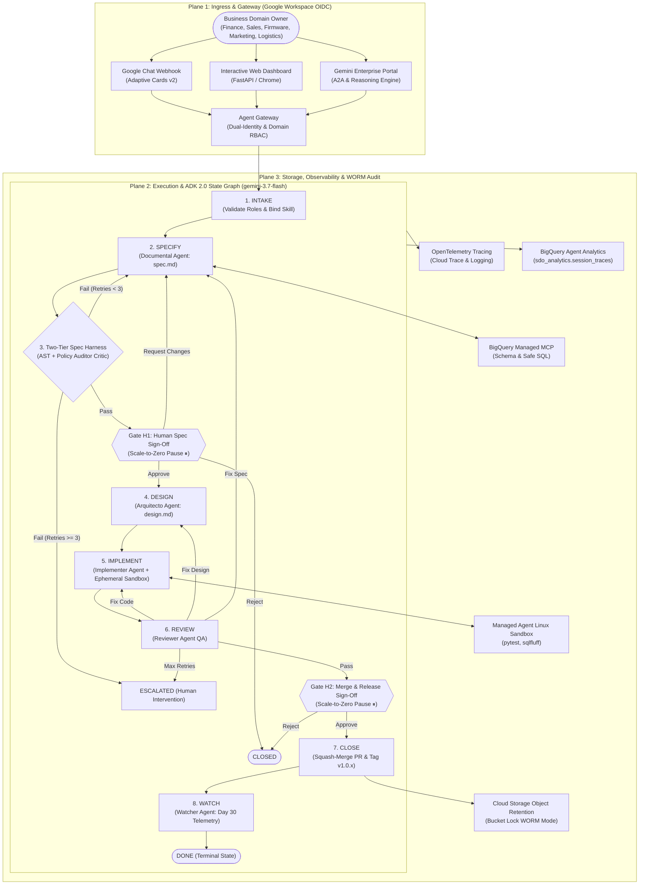

# Wallbox SDO Platform — Autonomous Software & Data Delivery Engine on Google Cloud Platform

[](https://www.python.org/)
[](https://cloud.google.com/vertex-ai)
[](https://adk.dev)
[](https://cloud.google.com/storage/docs/bucket-lock)
[-brightgreen.svg)](tests/)
[](eval/)

> **Wallbox Software Delivery Optimization (SDO) Platform**  
> An enterprise-grade, human-supervised multi-agent system built on **Google Cloud Platform (GCP)**. It automates data engineering, firmware telemetry analysis, commercial reporting, marketing attribution, and supply-chain logistics workflows using **Gemini 3.7 Flash** and **Google ADK 2.0 State Graphs**.

---

## 📑 Table of Contents
1. [Executive Summary & Core Highlights](#-executive-summary--core-highlights)
2. [Level 300 GCP Reference Architecture](#-level-300-gcp-reference-architecture)
3. [3-Plane Governance Model](#-3-plane-governance-model)
4. [Multi-Domain Skill Registry (5 Domains)](#-multi-domain-skill-registry-5-domains)
5. [Deterministic State Graph & Human Gates](#-deterministic-state-graph--human-gates)
6. [Governed Tooling & Ephemeral Sandboxes](#-governed-tooling--ephemeral-sandboxes)
7. [Observability, BigQuery Analytics & WORM Audit](#-observability-bigquery-analytics--worm-audit)
8. [Gemini Enterprise Integration (Option A & Option B)](#-gemini-enterprise-integration)
9. [Quickstart & Local Verification](#-quickstart--local-verification)
10. [1-Click Project Replication Guide (Any GCP Project)](#-1-click-project-replication-guide)
11. [Live Demo Runbook](#-live-demo-runbook)
12. [Repository Structure](#-repository-structure)

---

## ⚡ Executive Summary & Core Highlights

The Wallbox SDO Platform eliminates manual software and data delivery bottlenecks while maintaining strict corporate governance:

- **Gemini 3.7 Flash Reasoning Engine:** 2,000,000 token context window, structured JSON synthesis, sub-second latency.
- **100% Deterministic ADK 2.0 State Graphs:** State machine transitions and cyclic retry budgets ($N=3$) are calculated strictly in Python. Zero LLM routing.
- **Scale-to-Zero Human Governance:** Human approval gates (**Gate H1** for specifications, **Gate H2** for deployment) pause compute at $0 idle cost without session timeout crashes.
- **Two-Tier Quality Harness:** Tier 1 static AST/regex rules + Tier 2 `PolicyAuditorAgent` verifying SOC 2, GDPR, and scope boundaries before human review.
- **Multi-Domain Skill Registry:** Modular YAML manifests (`finance.yaml`, `sales.yaml`, `firmware.yaml`, `marketing.yaml`, `logistics.yaml`) governing Intake, Spec Policies, and Sandbox Acceptance Criteria.
- **Governed BigQuery MCP & GitHub VCS:** First-party schema introspection on BigQuery datasets and automated Pull Request squash-merging with semantic release tagging (`v1.0.x`).
- **Ephemeral Managed Linux Sandbox:** Isolated container execution running `pytest` and `sqlfluff` with 100% test pass verification.
- **WORM Audit Trail:** Cloud Storage Object Retention (Bucket Lock in WORM mode) storing tamper-evident SHA-256 state snapshots.
- **Dual Gemini Enterprise Deployment:** Supports both **Cloud Run A2A Protocol** (Option A) and **Vertex AI Agent Runtime Reasoning Engine** (Option B).

---

## 🏗 Level 300 GCP Reference Architecture



---

## 🛡 3-Plane Governance Model

```
+-------------------------------------------------------------------------------------------------------+
| PLANE 1: DEFINITIONS & CONTRACTS (Multi-Domain Skill Registry)                                        |
| Domain Manifests (finance, sales, firmware, marketing, logistics), Pydantic Schemas, Agent Prompts    |
+-------------------------------------------------------------------------------------------------------+
                                                  |
                                                  v
+-------------------------------------------------------------------------------------------------------+
| PLANE 2: DELIVERABLES & WORK PRODUCTS (GitHub VCS & Ephemeral Sandboxes)                              |
| spec.md, design.md, BigQuery SQL Views, Python Logic, Sandbox Test Suites, Pull Requests, Tags       |
+-------------------------------------------------------------------------------------------------------+
                                                  |
                                                  v
+-------------------------------------------------------------------------------------------------------+
| PLANE 3: IMMUTABLE AUDIT EVENT LOG (Cloud Storage Object Retention & BigQuery Analytics)              |
| SHA-256 Hashed JSON State Trajectories, OpenTelemetry Cloud Trace Spans, Execution Metrics           |
+-------------------------------------------------------------------------------------------------------+
```

---

## 📂 Multi-Domain Skill Registry (5 Domains)

Located in [`registry/skills/`](file:///usr/local/google/home/papelamine/Documents/Google/Dev/wallbox/Wallbox%20Public%20Shared/sdo-adk-engine/registry/skills), domain policies govern 3 lifecycle touchpoints:

| Domain | Manifest | Authorized BigQuery Tables | Mandatory Business Metrics | Prohibited Operations |
|---|---|---|---|---|
| **Finance** | [`finance.yaml`](file:///usr/local/google/home/papelamine/Documents/Google/Dev/wallbox/Wallbox%20Public%20Shared/sdo-adk-engine/registry/skills/finance.yaml) | `sdo_finance_demo.invoices`, `billing_events`, `exchange_rates`, `revenue_summary` | `reconciliation_variance_tolerance_pct`, `unreconciled_invoice_amount_usd` | `DROP TABLE`, `DELETE FROM`, unhedged currency conversion |
| **Sales** | [`sales.yaml`](file:///usr/local/google/home/papelamine/Documents/Google/Dev/wallbox/Wallbox%20Public%20Shared/sdo-adk-engine/registry/skills/sales.yaml) | `sdo_sales_demo.opportunities`, `accounts`, `pipeline_snapshots` | `conversion_variance_pct`, `weighted_pipeline_revenue_usd` | `DROP TABLE`, plain-text PII export |
| **Firmware** | [`firmware.yaml`](file:///usr/local/google/home/papelamine/Documents/Google/Dev/wallbox/Wallbox%20Public%20Shared/sdo-adk-engine/registry/skills/firmware.yaml) | `sdo_firmware_demo.charger_telemetry`, `error_logs`, `firmware_versions` | `telemetry_ingestion_delay_ms`, `error_frequency_per_charge_point` | `DROP TABLE`, raw token leakage, unvalidated OCPP frames |
| **Marketing** | [`marketing.yaml`](file:///usr/local/google/home/papelamine/Documents/Google/Dev/wallbox/Wallbox%20Public%20Shared/sdo-adk-engine/registry/skills/marketing.yaml) | `sdo_marketing_demo.campaign_events`, `user_acquisitions`, `touchpoint_attribution` | `cac_calculation_variance_pct`, `first_touch_attribution_pct` | `DROP TABLE`, unhashed customer emails, unconsented analytics |
| **Logistics** | [`logistics.yaml`](file:///usr/local/google/home/papelamine/Documents/Google/Dev/wallbox/Wallbox%20Public%20Shared/sdo-adk-engine/registry/skills/logistics.yaml) | `sdo_logistics_demo.inventory`, `warehouse_dispatch`, `transit_events` | `dispatch_sla_compliance_pct`, `inventory_turnover_ratio` | `DROP TABLE`, manual stock override |

---

## 🤖 Gemini 3.7 Flash Sub-Agents & Quality Harness

| Agent Persona | File | Model | Primary Mission |
|---|---|---|---|
| **Documental** | [`agents/documental.py`](file:///usr/local/google/home/papelamine/Documents/Google/Dev/wallbox/Wallbox%20Public%20Shared/sdo-adk-engine/agents/documental.py) | `gemini-3.7-flash` | Synthesizes `spec.md` with YAML frontmatter, Gherkin test scenarios, and BigQuery schema context. |
| **Two-Tier Harness** | [`harnesses/*.py`](file:///usr/local/google/home/papelamine/Documents/Google/Dev/wallbox/Wallbox%20Public%20Shared/sdo-adk-engine/harnesses) | `gemini-3.7-flash` | **Tier 1:** Static AST/schema validator.<br>**Tier 2:** `PolicyAuditorAgent` validating SOC 2, GDPR, and scope boundaries. |
| **Arquitecto** | [`agents/arquitecto.py`](file:///usr/local/google/home/papelamine/Documents/Google/Dev/wallbox/Wallbox%20Public%20Shared/sdo-adk-engine/agents/arquitecto.py) | `gemini-3.7-flash` | Generates `design.md`, architectural sequence diagrams, and sandbox test specifications. |
| **Implementer** | [`agents/implementer.py`](file:///usr/local/google/home/papelamine/Documents/Google/Dev/wallbox/Wallbox%20Public%20Shared/sdo-adk-engine/agents/implementer.py) | `gemini-3.7-flash` | Generates BigQuery SQL views and Python transforms, then executes them in an ephemeral Linux sandbox. |
| **Reviewer** | [`agents/reviewer.py`](file:///usr/local/google/home/papelamine/Documents/Google/Dev/wallbox/Wallbox%20Public%20Shared/sdo-adk-engine/agents/reviewer.py) | `gemini-3.7-flash` | Audits code against skill acceptance criteria (100% test pass rate, SQL linting, schema boundaries). |
| **Watcher** | [`agents/watcher.py`](file:///usr/local/google/home/papelamine/Documents/Google/Dev/wallbox/Wallbox%20Public%20Shared/sdo-adk-engine/agents/watcher.py) | `gemini-3.7-flash` | Monitors query execution latency, row scan volume, and SLA compliance 30 days post-deployment. |

---

## 🌐 Gemini Enterprise Integration

The application supports **both deployment options** in Gemini Enterprise:

```
+-------------------------------------------------------------------------------------------------------------------------+
|                                    GEMINI ENTERPRISE AGENT CATALOG                                                      |
+-------------------------------------------------------------------------------------------------------------------------+
| Option A:  Wallbox SDO - Option A (Cloud Run A2A with Web Dashboard & Gates)                                            |
|            • Protocol:         A2A (Agent-to-Agent v1.0)                                                                |
|            • Features:         Interactive Chrome Web visualizer, Gate H1 & H2 sign-off buttons, Google Chat webhook    |
|            • Service URL:      https://sdo-adk-cloudrun-a2a-<PROJECT_NUMBER>.<REGION>.run.app                            |
|            • Discovery Card:   .../a2a/app/.well-known/agent-card.json                                                  |
+-------------------------------------------------------------------------------------------------------------------------+
| Option B:  Wallbox SDO - Option B (Vertex AI Agent Runtime Engine)                                                      |
|            • Protocol:         Native ADK Reasoning Engine (:streamQuery)                                               |
|            • Target:           Vertex AI Agent Runtime (reasoningEngines)                                               |
|            • Features:         Pure headless Python execution, zero server management, streaming model responses        |
+-------------------------------------------------------------------------------------------------------------------------+
```

---

## 🚀 Quickstart & Local Verification

### 1. Prerequisites
- Python >= 3.12
- Google Cloud SDK (`gcloud`) authenticated
- Docker (optional for local container builds)

### 2. Install Dependencies
```bash
git clone https://github.com/wallbox/sdo-adk-engine.git
cd sdo-adk-engine
pip install -e ".[dev]"
```

### 3. Run Full Automated Test Suite (43 Tests)
```bash
python3 -m pytest tests/ -v
```

### 4. Run Offline Benchmark Evaluation Suite
```bash
python3 -m eval.evaluator --benchmark eval/benchmarks/finance_benchmarks.json
```
*Expected Output: Aggregate score 1.00 / 1.00 (PASS).*

### 5. Start Local Web Dashboard & API
```bash
python3 -m uvicorn web.app:app --host 127.0.0.1 --port 8080 --reload
```
Open **`http://localhost:8080`** in **Google Chrome** to launch loops and sign off on gates.

---

## 🔄 1-Click Project Replication Guide (Deploy to Any GCP Project)

To rebuild and deploy this entire platform into a new GCP project (e.g. `your-company-prod`):

### Step 1: Set Target Project & Authenticate
```bash
export TARGET_PROJECT="your-target-project-id"
export TARGET_REGION="us-central1"

gcloud config set project "${TARGET_PROJECT}"
gcloud auth application-default set-quota-project "${TARGET_PROJECT}"
```

### Step 2: Enable Required GCP APIs
```bash
gcloud services enable \
  run.googleapis.com \
  aiplatform.googleapis.com \
  discoveryengine.googleapis.com \
  bigquery.googleapis.com \
  storage.googleapis.com \
  cloudtrace.googleapis.com \
  logging.googleapis.com \
  cloudbuild.googleapis.com \
  --project="${TARGET_PROJECT}"
```

### Step 3: Deploy Infrastructure via Terraform
```bash
cd terraform
terraform init
terraform apply \
  -var="project_id=${TARGET_PROJECT}" \
  -var="region=${TARGET_REGION}" \
  -auto-approve
```
*Terraform automatically provisions:*
1. Cloud Run service (`sdo-adk-engine`)
2. Cloud Storage Object Retention WORM bucket (`sdo-worm-audit-${TARGET_PROJECT}`)
3. BigQuery Demo Datasets (`sdo_finance_demo`) and Agent Analytics (`sdo_analytics`)
4. BigQuery sample invoice/billing tables from `sample_data.sql`

### Step 4: Deploy & Register to Gemini Enterprise
```bash
cd ..
# Deploy Cloud Run container & Register Option A + Option B
./scripts/deploy_both_to_gemini_enterprise.sh
```

---

## 🎮 Live Demo Runbook

### Option 1: Via Interactive Web Dashboard
1. Open the Cloud Run URL (or `http://localhost:8080`).
2. Select domain `finance` and enter brief:  
   *"Create a weekly currency variance analysis view comparing EUR invoices with USD receipts."*
3. Click **`🚀 Launch Delivery Loop`**.
4. Review generated Gherkin `spec.md` and click **`✅ Approve Specification`** (Gate H1).
5. Watch the **Ephemeral Linux Sandbox** compile and pass tests with **100% pass rate**.
6. Click **`🚀 Approve Merge & Deploy`** (Gate H2).
7. Confirm loop transitions to **`DONE`**, Pull Request is merged, and WORM audit record is sealed.

### Option 2: 1-Click Terminal Verification Script
```bash
python3 -c "
import urllib.request, json
BASE_URL = 'https://sdo-adk-cloudrun-a2a-316329647160.us-central1.run.app'

# 1. Create Loop
req = urllib.request.Request(f'{BASE_URL}/api/v1/loops', data=json.dumps({
    'node_id': 'finance',
    'brief_text': 'Create weekly FX variance analysis view.',
    'owner_email': 'sarah.controller@wallbox.com'
}).encode(), headers={'Content-Type': 'application/json'})
with urllib.request.urlopen(req) as r:
    loop = json.loads(r.read())
    loop_id = loop['loop_id']
    print(f'[PASS] Loop Created: {loop_id} (State: {loop[\"current_state\"]})')

# 2. Gate H1 Sign-Off
h1_req = urllib.request.Request(f'{BASE_URL}/api/v1/loops/{loop_id}/gates/h1/resolve', data=json.dumps({
    'decision': 'approve', 'comment': 'Spec approved'
}).encode(), headers={'Content-Type': 'application/json'})
with urllib.request.urlopen(h1_req) as r:
    res_h1 = json.loads(r.read())
    print(f'[PASS] Gate H1 Approved -> Sandbox Passed (State: {res_h1[\"current_state\"]})')

# 3. Gate H2 Sign-Off
h2_req = urllib.request.Request(f'{BASE_URL}/api/v1/loops/{loop_id}/gates/h2/resolve', data=json.dumps({
    'decision': 'approve', 'comment': 'Merge approved'
}).encode(), headers={'Content-Type': 'application/json'})
with urllib.request.urlopen(h2_req) as r:
    res_h2 = json.loads(r.read())
    print(f'[PASS] Gate H2 Approved -> DONE (PR: {res_h2[\"pull_request_url\"]})')
    print(f'[PASS] WORM Audit Seal: {res_h2[\"worm_audit_record_id\"]}')
"
```

---

## 📁 Repository Structure

```
sdo-adk-engine/
├── pyproject.toml                  # Python 3.12+, google-adk>=2.5.0, google-genai, fastapi, pytest
├── Dockerfile                      # Production container packaging
├── Procfile                        # Cloud Buildpacks container entrypoint
├── deployment_metadata.json        # Gemini Enterprise deployment metadata
├── README.md                       # Master platform guide
├── config/
│   ├── settings.py                 # Pydantic Settings (GCP Project: managed-agent-504409, Model: gemini-3.7-flash)
│   └── nodes.yaml                  # Multi-tenant domain definitions (finance, sales, firmware, marketing, logistics)
├── gateway/
│   ├── auth.py                     # Google Workspace OIDC identity & role extraction
│   ├── policy_interceptor.py       # Domain access control, table allowlists & skill binding
│   └── chat_adapter.py             # Google Chat Adaptive Cards v2 formatter
├── registry/
│   ├── skill_registry.py           # Dynamic YAML skill loader and policy engine
│   └── skills/                     # Domain manifests
│       ├── finance.yaml            # Finance rules, tables, metrics, prohibited SQL
│       ├── sales.yaml              # Sales opportunity pipeline & PII rules
│       ├── firmware.yaml           # Firmware telemetry & OCPP 1.6J/2.0.1 rules
│       ├── marketing.yaml          # Marketing multi-touch attribution & CAC rules
│       └── logistics.yaml          # Warehouse inventory & dispatch SLA rules
├── graphs/
│   ├── state.py                    # Master LoopState Pydantic model
│   ├── router.py                   # 100% deterministic Python routers (spec harness, review, gates)
│   └── workflow.py                 # ADK StateGraph construction & compilation
├── agents/
│   ├── documental.py               # Documental Agent (spec.md authoring with gemini-3.7-flash)
│   ├── arquitecto.py               # Arquitecto Agent (design.md & test plan authoring)
│   ├── implementer.py              # Implementer Agent (code/SQL generation + Sandbox runner)
│   ├── reviewer.py                 # Reviewer Agent (QA, test validation & acceptance criteria)
│   └── watcher.py                  # Watcher Agent (Day 30 telemetry & SLA evaluation)
├── harnesses/
│   ├── tier1_static_rules.py       # Deterministic AST & Pydantic Gherkin parser
│   ├── tier2_policy_critic.py      # PolicyAuditorAgent compliance critic (gemini-3.7-flash)
│   └── harness_node.py             # Composite Two-Tier Quality Harness node
├── tools/
│   ├── bq_mcp_client.py            # BigQuery Managed MCP connector with schema introspection
│   ├── github_client.py            # GitHub PR creation, squash-merge, and release tagging
│   └── managed_sandbox.py          # Ephemeral Linux sandbox runner (isolated pytest & sqlfluff)
├── storage/
│   └── worm_audit.py               # Cloud Storage Object Retention WORM writer (SHA-256 digests)
├── observability/
│   ├── otel.py                     # OpenTelemetry instrumentation (Cloud Trace & Logging)
│   └── analytics.py                # BigQuery Agent Analytics plugin (sdo_analytics)
├── eval/
│   ├── evaluator.py                # Gemini Enterprise evaluation suite
│   ├── custom_metrics.py           # Custom evaluators (Gherkin adherence, Graph conformance, Skill compliance)
│   └── benchmarks/                 # Ground truth evaluation datasets (finance_benchmarks.json)
├── web/
│   ├── app.py                      # FastAPI control plane, REST API, A2A card endpoint, Chat webhook
│   └── static/                     # Web Dashboard SPA (visual FSM graph, gate cards, diff view)
├── terraform/                      # Complete GCP Infrastructure as Code
│   ├── main.tf                     # Cloud Run, Cloud Storage WORM bucket, BigQuery datasets
│   ├── variables.tf                # Configurable parameters (project_id, region)
│   ├── outputs.tf                  # Deployed service URLs and resource identifiers
│   └── sample_data.sql             # BigQuery sdo_finance_demo sample billing/invoice tables
├── scripts/
│   ├── deploy_both_to_gemini_enterprise.sh  # Automated dual deployment script
│   ├── register_gemini_enterprise.sh        # Standard agents-cli publish script
│   └── register_with_gcloud_auth.py         # Direct Gemini Enterprise API registrar
├── tests/
│   ├── unit/                       # Fast unit tests (routing, harnesses, skills, API, OTel, eval)
│   └── integration/                # Full E2E domain scenarios (Finance, Sales, Firmware, Marketing, Logistics)
└── docs/
    ├── architecture.md             # Level 300 GCP Reference Architecture
    ├── demo_script.md              # Interactive Live Demo Walkthrough
    ├── replication_guide.md        # Step-by-step new GCP project onboarding guide
    ├── validation_matrix.md        # Authoritative 43-point test matrix
    └── google_chat_setup.md        # Google Chat App manifest and webhook guide
```

---

## 🔒 Security & SOC 2 Type II Compliance

- **Zero-Trust Access Control:** Agent Gateway validates Google Workspace OIDC tokens and enforces domain-level RBAC.
- **WORM Audit Lock:** Cloud Storage Object Retention (Bucket Lock) enforces immutable, non-deletable records for every state change.
- **Secure Ephemeral Execution:** Code and SQL queries are compiled and tested inside isolated Linux sandboxes with zero host file system access.
- **Data Boundary Isolation:** Table allowlists prevent cross-department data leakage. Destructive SQL operations (`DROP TABLE`, `DELETE FROM`) are rejected deterministically before human review.
