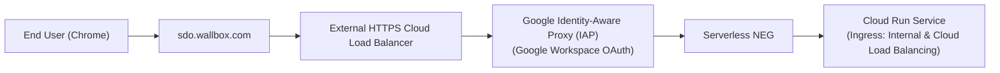

# Org Policy Compliance & Access Guide: Identity-Aware Proxy (IAP) and Cloud Run IAM

## 🔒 The Constraint: `constraints/run.managed.requireInvokerIam`

Many enterprise Google Cloud organizations enforce the organizational policy:
```text
constraints/run.managed.requireInvokerIam: When enforced, this constraint requires the IAM invoker check to be enabled on Cloud Run services.
```

### What This Means
- Public, unauthenticated access via `allUsers` $\to$ `roles/run.invoker` is strictly **blocked**.
- Every request reaching the Cloud Run service must carry valid authentication (IAM Identity Token, IAP JWT, or Google Workspace credentials).

---

## 🛠 4 Supported Solutions & Workarounds

### 1. Developer / Interactive Chrome Access via Authenticated Local Proxy (Instant & Zero Config)

For local testing and Chrome Web Dashboard access without public IP exposure:
```bash
./scripts/start_iam_proxy.sh
```
or directly:
```bash
gcloud run services proxy sdo-adk-cloudrun-a2a \
  --region=us-central1 \
  --project=managed-agent-504409 \
  --port=8080
```
- **How it works:** Starts a local proxy on `http://localhost:8080`. Every request from your Chrome browser is automatically signed with your active `gcloud` identity token.
- **Org Policy Compliance:** 100% compliant because every request is signed with IAM credentials.

---

### 2. Domain & User-Level IAM Policy Bindings

Instead of granting `roles/run.invoker` to `allUsers`, grant it to your company domain or specific user accounts:

```bash
# Grant access to your corporate domain (e.g. wallbox.com or google.com)
gcloud run services add-iam-policy-binding sdo-adk-cloudrun-a2a \
  --region=us-central1 \
  --project=managed-agent-504409 \
  --member="domain:wallbox.com" \
  --role="roles/run.invoker"

# Grant access to a specific user
gcloud run services add-iam-policy-binding sdo-adk-cloudrun-a2a \
  --region=us-central1 \
  --project=managed-agent-504409 \
  --member="user:sarah.controller@wallbox.com" \
  --role="roles/run.invoker"

# Grant access to Gemini Enterprise / Agent Runtime Service Account
gcloud run services add-iam-policy-binding sdo-adk-cloudrun-a2a \
  --region=us-central1 \
  --project=managed-agent-504409 \
  --member="serviceAccount:service-316329647160@gcp-sa-aiplatform-re.iam.gserviceaccount.com" \
  --role="roles/run.invoker"
```

---

### 3. Enterprise Identity-Aware Proxy (IAP) & HTTPS Cloud Load Balancer (Production Gold Standard)

In production, external users access the platform through an HTTPS Application Load Balancer with **Identity-Aware Proxy (IAP)** enabled.

#### Architecture:


#### Terraform Provisioning:
The Terraform file [`terraform/iap_load_balancer.tf`](file:///usr/local/google/home/papelamine/Documents/Google/Dev/enterprise/Wallbox%20Public%20Shared/sdo-adk-engine/terraform/iap_load_balancer.tf) configures:
1. **Serverless NEG:** `google_compute_region_network_endpoint_group.serverless_neg` pointing to Cloud Run.
2. **Backend Service with IAP:** `google_compute_backend_service.iap_backend` with `iap.enabled = true`.
3. **IAP Service Account Invoker:** Grants `roles/run.invoker` to `serviceAccount:service-<PROJECT_NUMBER>@gcp-sa-iap.iam.gserviceaccount.com`.

#### Automatic Identity Forwarding:
When IAP is enabled, Google passes:
- `X-Goog-Authenticated-User-Email`: e.g. `accounts.google.com:sarah.controller@wallbox.com`
- `X-Goog-Iap-Jwt-Assertion`: Cryptographically signed JWT token

The application automatically extracts this in [`gateway/auth.py`](file:///usr/local/google/home/papelamine/Documents/Google/Dev/enterprise/Wallbox%20Public%20Shared/sdo-adk-engine/gateway/auth.py) and [`web/app.py`](file:///usr/local/google/home/papelamine/Documents/Google/Dev/enterprise/Wallbox%20Public%20Shared/sdo-adk-engine/web/app.py) to authenticate the user and bind their domain RBAC roles.

---

### 4. API & Programmatic Access (Identity Token Header)

For automated pipelines, scripts, and webhook integrations, pass an IAM Identity Token in the `Authorization` header:

```bash
ID_TOKEN=$(gcloud auth print-identity-token)

curl -X POST "https://sdo-adk-cloudrun-a2a-316329647160.us-central1.run.app/api/v1/loops" \
  -H "Authorization: Bearer ${ID_TOKEN}" \
  -H "Content-Type: application/json" \
  -d '{
    "node_id": "finance",
    "brief_text": "Create weekly FX variance analysis view.",
    "owner_email": "sarah.controller@wallbox.com"
  }'
```
