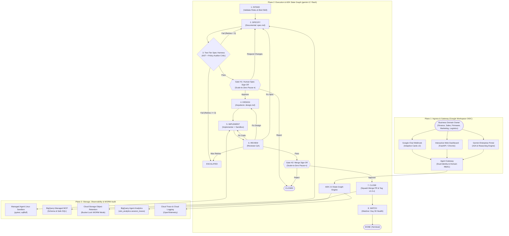
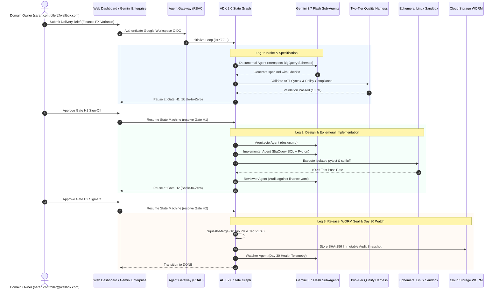

# Level 300 Reference Architecture: Wallbox SDO Platform on GCP

## 1. System Overview & 3-Plane Governance Model

The Wallbox Software Delivery Optimization (SDO) Platform orchestrates specialized **Gemini 3.7 Flash** sub-agents within a deterministic **Google ADK 2.0 State Graph** to automate software and data delivery for business domain owners (Finance, Sales, Firmware, Marketing, Logistics).

---

## 2. Core Architectural Components

### 2.1 Core Reasoning Engine (`gemini-3.7-flash`)
- **Context Window:** 2,000,000 tokens (eliminating legacy AWS token truncation).
- **Sub-Agent Personas:**
  - `documental`: Gherkin `spec.md` synthesis with BigQuery schema context.
  - `arquitecto`: Technical blueprints (`design.md`) and sandbox test plans.
  - `implementer`: Code/SQL synthesis and ephemeral sandbox runner.
  - `reviewer`: Code auditing, negative testing, and acceptance criteria verification.
  - `watcher`: Day 30 post-deployment query latency and SLA evaluation.
  - `PolicyAuditorAgent`: SOC 2, GDPR data isolation, and scope compliance critic.

### 2.2 Deterministic State Graph Engine (`graphs/workflow.py`)
- **100% Python Routing:** State graph edges and cyclic retries are strictly calculated in Python. No LLM decides state machine transitions.
- **Scale-to-Zero Persistence:** During human approval pauses at Gate H1 and Gate H2, session state freezes in persistent storage with $0 compute cost.

### 2.3 Multi-Domain Skill Registry (`registry/skills/`)
- Dynamic domain manifests (`finance.yaml`, `sales.yaml`, `firmware.yaml`, `marketing.yaml`, `logistics.yaml`) governing 3 lifecycle touchpoints:
  1. *Intake Guidance:* Brief prompting and required parameters.
  2. *Spec Validation Policies:* Table allowlists, mandatory metrics, and prohibited SQL operations.
  3. *Post-Implementation Acceptance:* Deterministic assertions (100% test pass rate, query budget, mandatory test types).

### 2.4 Ephemeral Managed Sandboxes (`tools/managed_sandbox.py`)
- Executes generated code and `pytest` test suites in an isolated temporary container, preventing unconstrained host access.

### 2.5 Plane 3 WORM Audit (`storage/worm_audit.py`)
- Immutable audit records written to Cloud Storage Object Retention (`audit/{node}/{loop}/{seq:08d}/{event_id}.json`) with SHA-256 integrity digests.

---

## 3. Data Flow & Sequence Diagram

