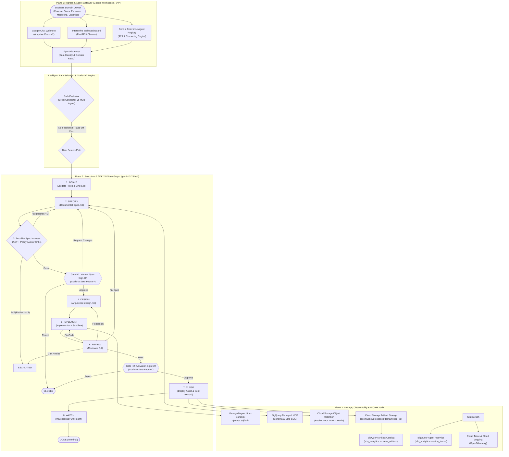

# Level 300 Reference Architecture: Wallbox SDO Platform on GCP

## 1. System Overview & 3-Plane Governance Model

The Wallbox Software Delivery Optimization (SDO) Platform orchestrates specialized **Gemini 3.7 Flash** sub-agents within a deterministic **Google ADK 2.0 State Graph** to automate software and data delivery for business domain owners (Finance, Sales, Firmware, Marketing, Logistics).

---

## 2. Core Architectural Subsystems

### 2.1 Agent Gateway & Dual-Identity Protocol (`gateway/`)
- **Google Workspace / IAP Validation:** Ingests user identity from OIDC tokens or `X-Goog-Authenticated-User-Email` header, completely avoiding public IP exposure.
- **Dual-Identity Classification:** Isolates **Human User Actions** from machine **Agent Service Accounts** (`sa-sdo-{node}@...`).
- **Domain RBAC & Allowlisting:** Matches initiator roles against the domain skill manifest before invoking any agent.

### 2.2 Agent Registry in Gemini Enterprise
- Central registry managing A2A discovery cards, ADK Reasoning Engines, and extensible MCP connector catalogs (BigQuery, Cloud Storage, Salesforce, NetSuite, Notion).

### 2.3 Multi-Domain Skill Registry (`registry/skills/`)
- 5 modular domain manifests (`finance.yaml`, `sales.yaml`, `firmware.yaml`, `marketing.yaml`, `logistics.yaml`) defining authorized roles, table allowlists, mandatory business metrics, and prohibited operations (`DROP TABLE`, `DELETE FROM`).

### 2.4 Intelligent Path Selection Engine (`agents/tradeoff_evaluator.py`)
- Evaluates business briefs at Intake and presents non-technical trade-off matrices:
  - **Path 1: Direct Connector Automation (Tool-Native / MCP):** Fast (<5s), $0 server compute, ideal for reports and queries pulling across tools.
  - **Path 2: Autonomous Multi-Agent Software Development (Full ADK Graph):** Synthesizes custom Python code, blueprints, and runs isolated Linux sandbox tests.
- Retains **Gate H1** and **Gate H2** across both paths.

### 2.5 Structured GCS Artifact Storage & BigQuery Catalog (`storage/artifact_catalog.py`)
- Partitioned storage hierarchy in Cloud Storage (`gs://<bucket>/processes/{domain}/{loop_id}/`).
- Synchronized metadata indexing in BigQuery (`sdo_analytics.process_artifacts`) for instant search, filtering, and audit monitoring.

### 2.6 Plane 3 WORM Cryptographic Audit (`storage/worm_audit.py`)
- Cloud Storage Object Retention (Bucket Lock in WORM mode) storing tamper-evident SHA-256 JSON snapshots for SOC 2 Type II compliance.
